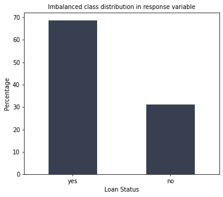
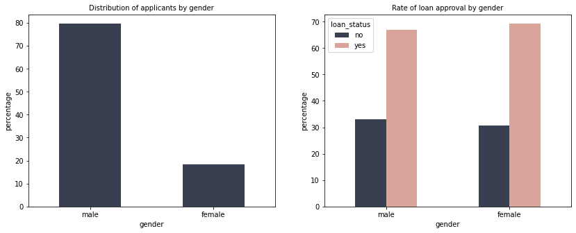
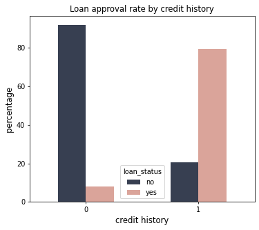
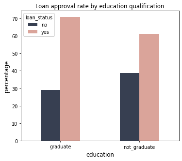
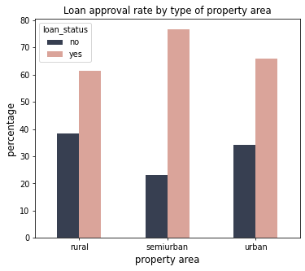
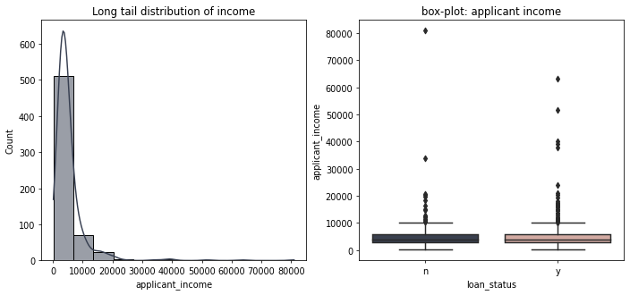
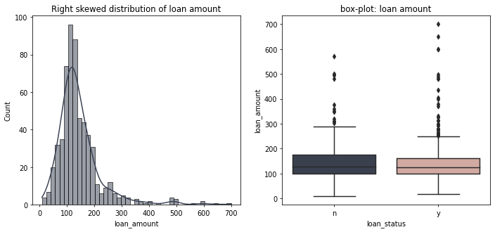
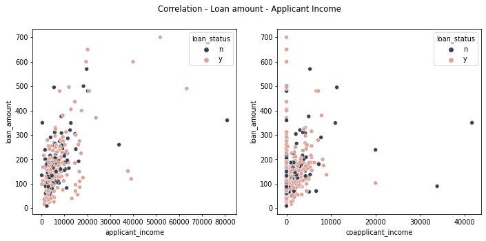

```python
# importing libraries
import pandas as pd
import numpy as np 

import matplotlib.pyplot as plt
import seaborn as sns
%matplotlib inline

from scipy import stats

# Setting color palatte
colors = ['#373F51','#DAA49A','#58A4B0','#D8DBE2']
sns.set_palette(colors)

plt.rcParams['figure.dpi'] = 70
plt.rcParams['figure.figsize'] = [6, 5]
```


```python
# reading data 
train_data = pd.read_csv("train.csv")

# view first five rows
train_data.head()
```


<div>
<style scoped>
    .dataframe tbody tr th:only-of-type {
        vertical-align: middle;
    }

    .dataframe tbody tr th {
        vertical-align: top;
    }

    .dataframe thead th {
        text-align: right;
    }
</style>
<table border="1" class="dataframe">
  <thead>
    <tr style="text-align: right;">
      <th></th>
      <th>Loan_ID</th>
      <th>Gender</th>
      <th>Married</th>
      <th>Dependents</th>
      <th>Education</th>
      <th>Self_Employed</th>
      <th>ApplicantIncome</th>
      <th>CoapplicantIncome</th>
      <th>LoanAmount</th>
      <th>Loan_Amount_Term</th>
      <th>Credit_History</th>
      <th>Property_Area</th>
      <th>Loan_Status</th>
    </tr>
  </thead>
  <tbody>
    <tr>
      <th>0</th>
      <td>LP001002</td>
      <td>Male</td>
      <td>No</td>
      <td>0</td>
      <td>Graduate</td>
      <td>No</td>
      <td>5849</td>
      <td>0.0</td>
      <td>NaN</td>
      <td>360.0</td>
      <td>1.0</td>
      <td>Urban</td>
      <td>Y</td>
    </tr>
    <tr>
      <th>1</th>
      <td>LP001003</td>
      <td>Male</td>
      <td>Yes</td>
      <td>1</td>
      <td>Graduate</td>
      <td>No</td>
      <td>4583</td>
      <td>1508.0</td>
      <td>128.0</td>
      <td>360.0</td>
      <td>1.0</td>
      <td>Rural</td>
      <td>N</td>
    </tr>
    <tr>
      <th>2</th>
      <td>LP001005</td>
      <td>Male</td>
      <td>Yes</td>
      <td>0</td>
      <td>Graduate</td>
      <td>Yes</td>
      <td>3000</td>
      <td>0.0</td>
      <td>66.0</td>
      <td>360.0</td>
      <td>1.0</td>
      <td>Urban</td>
      <td>Y</td>
    </tr>
    <tr>
      <th>3</th>
      <td>LP001006</td>
      <td>Male</td>
      <td>Yes</td>
      <td>0</td>
      <td>Not Graduate</td>
      <td>No</td>
      <td>2583</td>
      <td>2358.0</td>
      <td>120.0</td>
      <td>360.0</td>
      <td>1.0</td>
      <td>Urban</td>
      <td>Y</td>
    </tr>
    <tr>
      <th>4</th>
      <td>LP001008</td>
      <td>Male</td>
      <td>No</td>
      <td>0</td>
      <td>Graduate</td>
      <td>No</td>
      <td>6000</td>
      <td>0.0</td>
      <td>141.0</td>
      <td>360.0</td>
      <td>1.0</td>
      <td>Urban</td>
      <td>Y</td>
    </tr>
  </tbody>
</table>
</div>


```python
# shape of the data
print("Number of instances  ::", train_data.shape[0])
print("Number of attributes ::", train_data.shape[1])
```

    Number of instances  :: 614
    Number of attributes :: 13
    


```python
# Columns names.
column_list = train_data.columns.tolist()
print("List of columns:: ", column_list)
```

    List of columns::  ['Loan_ID', 'Gender', 'Married', 'Dependents', 'Education', 'Self_Employed', 'ApplicantIncome', 'CoapplicantIncome', 'LoanAmount', 'Loan_Amount_Term', 'Credit_History', 'Property_Area', 'Loan_Status']
    


```python
# Clean up the column names.

# Rename the columns
rename_col = {
    'ApplicantIncome':'applicant_income',
    'CoapplicantIncome':'coapplicant_income',
    'LoanAmount':'loan_amount'
}

train_data.rename(columns=rename_col, inplace=True)
train_data.rename(columns={col:col.lower() for col in column_list}, inplace=True)        
```


```python
# view
train_data.head()
```


<div>
<style scoped>
    .dataframe tbody tr th:only-of-type {
        vertical-align: middle;
    }

    .dataframe tbody tr th {
        vertical-align: top;
    }

    .dataframe thead th {
        text-align: right;
    }
</style>
<table border="1" class="dataframe">
  <thead>
    <tr style="text-align: right;">
      <th></th>
      <th>loan_id</th>
      <th>gender</th>
      <th>married</th>
      <th>dependents</th>
      <th>education</th>
      <th>self_employed</th>
      <th>applicant_income</th>
      <th>coapplicant_income</th>
      <th>loan_amount</th>
      <th>loan_amount_term</th>
      <th>credit_history</th>
      <th>property_area</th>
      <th>loan_status</th>
    </tr>
  </thead>
  <tbody>
    <tr>
      <th>0</th>
      <td>LP001002</td>
      <td>Male</td>
      <td>No</td>
      <td>0</td>
      <td>Graduate</td>
      <td>No</td>
      <td>5849</td>
      <td>0.0</td>
      <td>NaN</td>
      <td>360.0</td>
      <td>1.0</td>
      <td>Urban</td>
      <td>Y</td>
    </tr>
    <tr>
      <th>1</th>
      <td>LP001003</td>
      <td>Male</td>
      <td>Yes</td>
      <td>1</td>
      <td>Graduate</td>
      <td>No</td>
      <td>4583</td>
      <td>1508.0</td>
      <td>128.0</td>
      <td>360.0</td>
      <td>1.0</td>
      <td>Rural</td>
      <td>N</td>
    </tr>
    <tr>
      <th>2</th>
      <td>LP001005</td>
      <td>Male</td>
      <td>Yes</td>
      <td>0</td>
      <td>Graduate</td>
      <td>Yes</td>
      <td>3000</td>
      <td>0.0</td>
      <td>66.0</td>
      <td>360.0</td>
      <td>1.0</td>
      <td>Urban</td>
      <td>Y</td>
    </tr>
    <tr>
      <th>3</th>
      <td>LP001006</td>
      <td>Male</td>
      <td>Yes</td>
      <td>0</td>
      <td>Not Graduate</td>
      <td>No</td>
      <td>2583</td>
      <td>2358.0</td>
      <td>120.0</td>
      <td>360.0</td>
      <td>1.0</td>
      <td>Urban</td>
      <td>Y</td>
    </tr>
    <tr>
      <th>4</th>
      <td>LP001008</td>
      <td>Male</td>
      <td>No</td>
      <td>0</td>
      <td>Graduate</td>
      <td>No</td>
      <td>6000</td>
      <td>0.0</td>
      <td>141.0</td>
      <td>360.0</td>
      <td>1.0</td>
      <td>Urban</td>
      <td>Y</td>
    </tr>
  </tbody>
</table>
</div>


```python
# Check if there is any duplicate records present in the data
train_data.duplicated().sum()
```


    0


```python
# Check the datatypes.
train_data.dtypes
```


    loan_id                object
    gender                 object
    married                object
    dependents             object
    education              object
    self_employed          object
    applicant_income        int64
    coapplicant_income    float64
    loan_amount           float64
    loan_amount_term      float64
    credit_history        float64
    property_area          object
    loan_status            object
    dtype: object


```python
# Check the unique values in categorical data.
categorical_cols = ['gender', 
                    'married', 
                    'dependents', 
                    'education', 
                    'self_employed', 
                    'credit_history', 
                    'property_area', 
                    'loan_status'
                    ]

for col in categorical_cols:
    print(f"{col.upper()} :: {train_data[col].unique()}")
    print(train_data[col].value_counts())
    print("---"*10)
```

    GENDER :: ['Male' 'Female' nan]
    Male      489
    Female    112
    Name: gender, dtype: int64
    ------------------------------
    MARRIED :: ['No' 'Yes' nan]
    Yes    398
    No     213
    Name: married, dtype: int64
    ------------------------------
    DEPENDENTS :: ['0' '1' '2' '3+' nan]
    0     345
    1     102
    2     101
    3+     51
    Name: dependents, dtype: int64
    ------------------------------
    EDUCATION :: ['Graduate' 'Not Graduate']
    Graduate        480
    Not Graduate    134
    Name: education, dtype: int64
    ------------------------------
    SELF_EMPLOYED :: ['No' 'Yes' nan]
    No     500
    Yes     82
    Name: self_employed, dtype: int64
    ------------------------------
    CREDIT_HISTORY :: [ 1.  0. nan]
    1.0    475
    0.0     89
    Name: credit_history, dtype: int64
    ------------------------------
    PROPERTY_AREA :: ['Urban' 'Rural' 'Semiurban']
    Semiurban    233
    Urban        202
    Rural        179
    Name: property_area, dtype: int64
    ------------------------------
    LOAN_STATUS :: ['Y' 'N']
    Y    422
    N    192
    Name: loan_status, dtype: int64
    ------------------------------
    


```python
"""
Let's change the case of string values in categorical columns in lower case and replace space if any with underscore(_).
& change the data type of those columns from `object` to `category`. 
"""

for col in categorical_cols:
    try:
        train_data[col] = train_data[col].str.lower().str.replace(" ", "_")
        train_data[col] = train_data[col].astype('category')                 # Type casting
    except AttributeError:
        pass
```


```python
# view
train_data.dtypes
```


    loan_id                 object
    gender                category
    married               category
    dependents            category
    education             category
    self_employed         category
    applicant_income         int64
    coapplicant_income     float64
    loan_amount            float64
    loan_amount_term       float64
    credit_history         float64
    property_area         category
    loan_status           category
    dtype: object


```python
train_data.head()
```


<div>
<style scoped>
    .dataframe tbody tr th:only-of-type {
        vertical-align: middle;
    }

    .dataframe tbody tr th {
        vertical-align: top;
    }

    .dataframe thead th {
        text-align: right;
    }
</style>
<table border="1" class="dataframe">
  <thead>
    <tr style="text-align: right;">
      <th></th>
      <th>loan_id</th>
      <th>gender</th>
      <th>married</th>
      <th>dependents</th>
      <th>education</th>
      <th>self_employed</th>
      <th>applicant_income</th>
      <th>coapplicant_income</th>
      <th>loan_amount</th>
      <th>loan_amount_term</th>
      <th>credit_history</th>
      <th>property_area</th>
      <th>loan_status</th>
    </tr>
  </thead>
  <tbody>
    <tr>
      <th>0</th>
      <td>LP001002</td>
      <td>male</td>
      <td>no</td>
      <td>0</td>
      <td>graduate</td>
      <td>no</td>
      <td>5849</td>
      <td>0.0</td>
      <td>NaN</td>
      <td>360.0</td>
      <td>1.0</td>
      <td>urban</td>
      <td>y</td>
    </tr>
    <tr>
      <th>1</th>
      <td>LP001003</td>
      <td>male</td>
      <td>yes</td>
      <td>1</td>
      <td>graduate</td>
      <td>no</td>
      <td>4583</td>
      <td>1508.0</td>
      <td>128.0</td>
      <td>360.0</td>
      <td>1.0</td>
      <td>rural</td>
      <td>n</td>
    </tr>
    <tr>
      <th>2</th>
      <td>LP001005</td>
      <td>male</td>
      <td>yes</td>
      <td>0</td>
      <td>graduate</td>
      <td>yes</td>
      <td>3000</td>
      <td>0.0</td>
      <td>66.0</td>
      <td>360.0</td>
      <td>1.0</td>
      <td>urban</td>
      <td>y</td>
    </tr>
    <tr>
      <th>3</th>
      <td>LP001006</td>
      <td>male</td>
      <td>yes</td>
      <td>0</td>
      <td>not_graduate</td>
      <td>no</td>
      <td>2583</td>
      <td>2358.0</td>
      <td>120.0</td>
      <td>360.0</td>
      <td>1.0</td>
      <td>urban</td>
      <td>y</td>
    </tr>
    <tr>
      <th>4</th>
      <td>LP001008</td>
      <td>male</td>
      <td>no</td>
      <td>0</td>
      <td>graduate</td>
      <td>no</td>
      <td>6000</td>
      <td>0.0</td>
      <td>141.0</td>
      <td>360.0</td>
      <td>1.0</td>
      <td>urban</td>
      <td>y</td>
    </tr>
  </tbody>
</table>
</div>


```python
# Let's check for missing data.
train_data.isnull().sum()
```


    loan_id                0
    gender                13
    married                3
    dependents            15
    education              0
    self_employed         32
    applicant_income       0
    coapplicant_income     0
    loan_amount           22
    loan_amount_term      14
    credit_history        50
    property_area          0
    loan_status            0
    dtype: int64


```python
# Response variable - loan_status

# visualization
(train_data['loan_status'].value_counts() * 100 / len(train_data)).plot(kind='bar')

# labels
plt.xlabel("Loan Status", size=10)
plt.ylabel("Percentage", size=10)
plt.title("Imbalanced class distribution in response variable", size=10)

plt.xticks(ticks=[0, 1], labels=['yes', 'no'], rotation=0)
plt.show()
```


    

    


```python
# Correlation analysis
def compute_chi2(column):
    """
    compute_corr(column1):
        function to compute the correlation between the categorical variable and response variale(y)
    
    """
    threshold = 0.05
    ct = pd.crosstab(train_data[column], train_data['loan_status'])    
    result = stats.chi2_contingency(ct)
    
    p_value = result[1]
    
    if p_value < threshold:
        return "P-value=%f; The null hypothesis is rejected; %s & loan_status are dependent" % (p_value, column)
    return "P-value=%f; The null hypothesis is accepted; %s & loan_status are not dependent" % (p_value, column)

```


```python
# Gender 
"""Let's find if the `gender` of the applicant is matter in loan approval."""
fig, (ax1, ax2) = plt.subplots(nrows=1, ncols=2, figsize=(14, 5), dpi=72)

# Data preparation
a = train_data['gender'].value_counts() * 100 / len(train_data)  
b = train_data.groupby(by=['gender', 'loan_status']).count()['loan_id'] * 100 / train_data.groupby(by=['gender']).count()['loan_id']

# Visualizations
# plot-1
a.plot(kind='bar', ax=ax1) 

ax1.set_title("Distribution of applicants by gender", size=10)
ax1.set_xlabel("gender", size=10)
ax1.set_ylabel("percentage", size=10)

ax1.set_xticks(ticks=[0, 1], labels=['male', 'female'], rotation=0)

# plot-2
b.unstack().plot(kind='bar', ax=ax2)

ax2.set_title("Rate of loan approval by gender", size=10)
ax2.set_xlabel("gender", size=10)
ax2.set_ylabel("percentage", size=10)

ax2.legend(labels=['no', 'yes'], title='loan_status')
ax2.set_xticks(ticks=[0, 1], labels=['male', 'female'], rotation=0)

plt.show()
```


    

    


Above plot shows that, There is huge difference between the male and female applicant for loan. However, the second plot shows that, rate of accepting or rejecting the loan application for home is almost same for both male and female applicant, hence we can say that, the approval of loan does not depend on the gender of the applicant. Let's confirm this finding by performing hypothesis test. 


```python
# Hypothesis test - 'Gender' vs. 'Loan status'
""" Let's perform a hypothesis test using chi square to find if the `gender` of the applicant is matter in loan approval.
    H0(null hypothesis): The gender of the applicant does not matter.
    H1(alternative hypothesis): The gender of the applicant is matter.
"""
compute_chi2('gender')
```


    'P-value=0.708653; The null hypothesis is accepted; gender & loan_status are not dependent'


From the above hypothesis test, we can say that the acceptance or rejections of the loan of particular applicant does not depends on their gender.


```python
# Let's find the relation between credit history and loan status.
# data preparation
a = train_data.groupby(by=['credit_history', 'loan_status']).count()['loan_id']* 100 / train_data.groupby(by=['credit_history']).count()['loan_id']

# plot
a.unstack().plot(kind='bar')

plt.title('Loan approval rate by credit history',size=12)
plt.xlabel('credit history', size=12)
plt.ylabel('percentage', size=12)

plt.xticks(ticks=[0, 1], labels=[0, 1], rotation=0)
plt.legend(labels=['no', 'yes'], title='loan_status')
plt.show()
```


    

    


The above plot shows high rate of loan rejection for applicant with no credit history, and high rate of loan approval for applicant with credit history. We can say that, there is higher chances for loan rejection if an applicant does not have a credit history as compare to the applicant with credit history.

So, we can say that, loan approval is depends on applicant's credit history. Again, we can confirm this finding by computing the chi square hypothesis test.


```python
# Hypothesis test - 'Credit history' vs. 'Loan status'
"""Let's find out if there is any dependency between credit-history and loan approval."""
compute_chi2('credit_history')
```


    'P-value=0.000000; The null hypothesis is rejected; credit_history & loan_status are dependent'


From the above hypothesis test, we can say that loan approval depends on credit history.


```python
# Let's find the relation between education and loan status.
# data preparation
a = train_data.groupby(by=['education', 'loan_status']).count()['loan_id']* 100 / train_data.groupby(by=['education']).count()['loan_id']

# plot
a.unstack().plot(kind='bar')

plt.title('Loan approval rate by education qualification',size=12)
plt.xlabel('education', size=12)
plt.ylabel('percentage', size=12)

plt.xticks(ticks=[0, 1], rotation=0)
plt.legend(labels=['no', 'yes'], title='loan_status')
plt.show()
```


    

    


Above plot shows small difference for rejecting and accepting loan application by education of an applicant. However, The rate of approval for graduate applicant is higher than the non-graduate applicant. Let's find out if loan approval depends on education of an applicant by hypothesis test.


```python
# Hypothesis test - 'Education' vs. 'Loan status'
""" Let's find out if there is any effect of educational background on loan approval. """
compute_chi2('education')
```


    'P-value=0.043100; The null hypothesis is rejected; education & loan_status are dependent'


The above hypothesis test says that, loan approval depends on education of an applicant.


```python
# property_area and loan status
# data preparation
a = train_data.groupby(by=['property_area', 'loan_status']).count()['loan_id']* 100 / train_data.groupby(by=['property_area']).count()['loan_id']

# plot
a.unstack().plot(kind='bar')

plt.title('Loan approval rate by type of property area',size=12)
plt.xlabel('property area', size=12)
plt.ylabel('percentage', size=12)

plt.xticks(ticks=[0, 1, 2], rotation=0)
plt.legend(labels=['no', 'yes'], title='loan_status')
plt.show()
```


    

    


We can see that, the home loan approval rate for `semi-urban` property area is higher than other two property areas. 


```python
# Correation between for categorical variables and loan status
scores = []
label = 'loan_status'
for col in categorical_cols[:-1]:
    threshold = 0.05
    ct = pd.crosstab(train_data[col], train_data[label])    
    result = stats.chi2_contingency(ct)
    scores.append((label, col, result[0], round(result[1], 5)))    
```


```python
corr_df = pd.DataFrame(scores, columns=['target', 'cat_feature', 'chi2_stats', 'p-value'])
corr_df.style.highlight_between(subset=['chi2_stats', 'p-value'], left=-1, right=0.05, color='skyblue')
```


<style type="text/css">
#T_61abd_row1_col3, #T_61abd_row3_col3, #T_61abd_row4_col2, #T_61abd_row5_col3, #T_61abd_row6_col3 {
  background-color: skyblue;
}
</style>
<table id="T_61abd">
  <thead>
    <tr>
      <th class="blank level0" >&nbsp;</th>
      <th id="T_61abd_level0_col0" class="col_heading level0 col0" >target</th>
      <th id="T_61abd_level0_col1" class="col_heading level0 col1" >cat_feature</th>
      <th id="T_61abd_level0_col2" class="col_heading level0 col2" >chi2_stats</th>
      <th id="T_61abd_level0_col3" class="col_heading level0 col3" >p-value</th>
    </tr>
  </thead>
  <tbody>
    <tr>
      <th id="T_61abd_level0_row0" class="row_heading level0 row0" >0</th>
      <td id="T_61abd_row0_col0" class="data row0 col0" >loan_status</td>
      <td id="T_61abd_row0_col1" class="data row0 col1" >gender</td>
      <td id="T_61abd_row0_col2" class="data row0 col2" >0.139626</td>
      <td id="T_61abd_row0_col3" class="data row0 col3" >0.708650</td>
    </tr>
    <tr>
      <th id="T_61abd_level0_row1" class="row_heading level0 row1" >1</th>
      <td id="T_61abd_row1_col0" class="data row1 col0" >loan_status</td>
      <td id="T_61abd_row1_col1" class="data row1 col1" >married</td>
      <td id="T_61abd_row1_col2" class="data row1 col2" >4.475019</td>
      <td id="T_61abd_row1_col3" class="data row1 col3" >0.034390</td>
    </tr>
    <tr>
      <th id="T_61abd_level0_row2" class="row_heading level0 row2" >2</th>
      <td id="T_61abd_row2_col0" class="data row2 col0" >loan_status</td>
      <td id="T_61abd_row2_col1" class="data row2 col1" >dependents</td>
      <td id="T_61abd_row2_col2" class="data row2 col2" >3.158340</td>
      <td id="T_61abd_row2_col3" class="data row2 col3" >0.367850</td>
    </tr>
    <tr>
      <th id="T_61abd_level0_row3" class="row_heading level0 row3" >3</th>
      <td id="T_61abd_row3_col0" class="data row3 col0" >loan_status</td>
      <td id="T_61abd_row3_col1" class="data row3 col1" >education</td>
      <td id="T_61abd_row3_col2" class="data row3 col2" >4.091490</td>
      <td id="T_61abd_row3_col3" class="data row3 col3" >0.043100</td>
    </tr>
    <tr>
      <th id="T_61abd_level0_row4" class="row_heading level0 row4" >4</th>
      <td id="T_61abd_row4_col0" class="data row4 col0" >loan_status</td>
      <td id="T_61abd_row4_col1" class="data row4 col1" >self_employed</td>
      <td id="T_61abd_row4_col2" class="data row4 col2" >0.000000</td>
      <td id="T_61abd_row4_col3" class="data row4 col3" >1.000000</td>
    </tr>
    <tr>
      <th id="T_61abd_level0_row5" class="row_heading level0 row5" >5</th>
      <td id="T_61abd_row5_col0" class="data row5 col0" >loan_status</td>
      <td id="T_61abd_row5_col1" class="data row5 col1" >credit_history</td>
      <td id="T_61abd_row5_col2" class="data row5 col2" >174.637297</td>
      <td id="T_61abd_row5_col3" class="data row5 col3" >0.000000</td>
    </tr>
    <tr>
      <th id="T_61abd_level0_row6" class="row_heading level0 row6" >6</th>
      <td id="T_61abd_row6_col0" class="data row6 col0" >loan_status</td>
      <td id="T_61abd_row6_col1" class="data row6 col1" >property_area</td>
      <td id="T_61abd_row6_col2" class="data row6 col2" >12.297623</td>
      <td id="T_61abd_row6_col3" class="data row6 col3" >0.002140</td>
    </tr>
  </tbody>
</table>


```python
# Discriptive analysis for numerical variable
subsets = ['applicant_income', 'coapplicant_income', 'loan_amount', 'loan_amount_term']
yes_d = round(train_data.loc[train_data.loan_status=='y', subsets].describe(), 2)
no_d = round(train_data.loc[train_data.loan_status=='n', subsets].describe(), 2)

pd.concat([yes_d, no_d], keys=["Loan status-yes", "Loan status-No"], axis=1)
```


<div>
<style scoped>
    .dataframe tbody tr th:only-of-type {
        vertical-align: middle;
    }

    .dataframe tbody tr th {
        vertical-align: top;
    }

    .dataframe thead tr th {
        text-align: left;
    }
</style>
<table border="1" class="dataframe">
  <thead>
    <tr>
      <th></th>
      <th colspan="4" halign="left">Loan status-yes</th>
      <th colspan="4" halign="left">Loan status-No</th>
    </tr>
    <tr>
      <th></th>
      <th>applicant_income</th>
      <th>coapplicant_income</th>
      <th>loan_amount</th>
      <th>loan_amount_term</th>
      <th>applicant_income</th>
      <th>coapplicant_income</th>
      <th>loan_amount</th>
      <th>loan_amount_term</th>
    </tr>
  </thead>
  <tbody>
    <tr>
      <th>count</th>
      <td>422.00</td>
      <td>422.00</td>
      <td>411.00</td>
      <td>414.00</td>
      <td>192.00</td>
      <td>192.00</td>
      <td>181.00</td>
      <td>186.00</td>
    </tr>
    <tr>
      <th>mean</th>
      <td>5384.07</td>
      <td>1504.52</td>
      <td>144.29</td>
      <td>341.07</td>
      <td>5446.08</td>
      <td>1877.81</td>
      <td>151.22</td>
      <td>344.06</td>
    </tr>
    <tr>
      <th>std</th>
      <td>5765.44</td>
      <td>1924.75</td>
      <td>85.48</td>
      <td>63.25</td>
      <td>6819.56</td>
      <td>4384.06</td>
      <td>85.86</td>
      <td>69.24</td>
    </tr>
    <tr>
      <th>min</th>
      <td>210.00</td>
      <td>0.00</td>
      <td>17.00</td>
      <td>12.00</td>
      <td>150.00</td>
      <td>0.00</td>
      <td>9.00</td>
      <td>36.00</td>
    </tr>
    <tr>
      <th>25%</th>
      <td>2877.50</td>
      <td>0.00</td>
      <td>100.00</td>
      <td>360.00</td>
      <td>2885.00</td>
      <td>0.00</td>
      <td>100.00</td>
      <td>360.00</td>
    </tr>
    <tr>
      <th>50%</th>
      <td>3812.50</td>
      <td>1239.50</td>
      <td>126.00</td>
      <td>360.00</td>
      <td>3833.50</td>
      <td>268.00</td>
      <td>129.00</td>
      <td>360.00</td>
    </tr>
    <tr>
      <th>75%</th>
      <td>5771.50</td>
      <td>2297.25</td>
      <td>161.00</td>
      <td>360.00</td>
      <td>5861.25</td>
      <td>2273.75</td>
      <td>176.00</td>
      <td>360.00</td>
    </tr>
    <tr>
      <th>max</th>
      <td>63337.00</td>
      <td>20000.00</td>
      <td>700.00</td>
      <td>480.00</td>
      <td>81000.00</td>
      <td>41667.00</td>
      <td>570.00</td>
      <td>480.00</td>
    </tr>
  </tbody>
</table>
</div>


The above table shows us the descriptive summary for attribute subset by loan status. Applicant and Co-applicant income mean seems to be same for both the status.

Let's further evaluate our findings using one-way ANOVA hypothesis test.


```python
# One way ANOVA hypothesis test.
"""
    Let's compute the one way anova hypothesis test,
    H0: The mean group of each category of loan status('y', 'n') is same.
    H1: There is difference between these two group means.
"""
f_stats, p_value = stats.f_oneway(train_data[train_data.loan_status == 'y']['applicant_income'], 
                                  train_data[train_data.loan_status=='n']['applicant_income'])

print("ANOVA hypothesis test::")
print("F_statistics::", f_stats)
print("P-value::", p_value)
```

    ANOVA hypothesis test::
    F_statistics:: 0.013574218522301743
    P-value:: 0.907287812130378
    

The above ANOVA test results of loan status has p-value which is greater than 0.05, which fail to reject the null hypothesis. This tells us that there is no statistically significant difference in means of loan status classes.


```python
# applicant income
fig, (ax1, ax2) = plt.subplots(nrows=1, ncols=2, figsize=(12, 5))
sns.histplot(data=train_data, x='applicant_income', bins=12, kde=True, ax=ax1)
ax1.set_title("Long tail distribution of income", size=12)

sns.boxplot(data=train_data, y='applicant_income', x='loan_status', ax=ax2)
ax2.set_title("box-plot: applicant income")
plt.show()
```


    

    


The above plot shows the long tail distribution for applicant income. It seems like there are some outliers present in the data. The above box plot shows, the average income of applicant for both loan status is same. 


```python
# coapplicant income
fig, (ax1, ax2) = plt.subplots(nrows=1, ncols=2, figsize=(12, 5))
sns.histplot(data=train_data, x='loan_amount', kde=True, ax=ax1)
ax1.set_title("Right skewed distribution of loan amount", size=12)

sns.boxplot(data=train_data, y='loan_amount', x='loan_status', ax=ax2)
ax2.set_title("box-plot: loan amount")
plt.show()
```


    

    


We can that the there is right skewed distribution of `loan amount` and this box plot also shows that there is no difference between means of loan amount for both classes.


```python
# Statistical description
train_data[subsets].corr().style.background_gradient(axis=0)
```


<style type="text/css">
#T_1966d_row0_col0, #T_1966d_row1_col1, #T_1966d_row2_col2, #T_1966d_row3_col3 {
  background-color: #023858;
  color: #f1f1f1;
}
#T_1966d_row0_col1, #T_1966d_row1_col0, #T_1966d_row1_col3, #T_1966d_row3_col2 {
  background-color: #fff7fb;
  color: #000000;
}
#T_1966d_row0_col2 {
  background-color: #5a9ec9;
  color: #f1f1f1;
}
#T_1966d_row0_col3 {
  background-color: #fdf5fa;
  color: #000000;
}
#T_1966d_row1_col2 {
  background-color: #e6e2ef;
  color: #000000;
}
#T_1966d_row2_col0 {
  background-color: #3b92c1;
  color: #f1f1f1;
}
#T_1966d_row2_col1 {
  background-color: #c9cee4;
  color: #000000;
}
#T_1966d_row2_col3 {
  background-color: #f1ebf5;
  color: #000000;
}
#T_1966d_row3_col0 {
  background-color: #f5eff6;
  color: #000000;
}
#T_1966d_row3_col1 {
  background-color: #f7f0f7;
  color: #000000;
}
</style>
<table id="T_1966d">
  <thead>
    <tr>
      <th class="blank level0" >&nbsp;</th>
      <th id="T_1966d_level0_col0" class="col_heading level0 col0" >applicant_income</th>
      <th id="T_1966d_level0_col1" class="col_heading level0 col1" >coapplicant_income</th>
      <th id="T_1966d_level0_col2" class="col_heading level0 col2" >loan_amount</th>
      <th id="T_1966d_level0_col3" class="col_heading level0 col3" >loan_amount_term</th>
    </tr>
  </thead>
  <tbody>
    <tr>
      <th id="T_1966d_level0_row0" class="row_heading level0 row0" >applicant_income</th>
      <td id="T_1966d_row0_col0" class="data row0 col0" >1.000000</td>
      <td id="T_1966d_row0_col1" class="data row0 col1" >-0.116605</td>
      <td id="T_1966d_row0_col2" class="data row0 col2" >0.570909</td>
      <td id="T_1966d_row0_col3" class="data row0 col3" >-0.045306</td>
    </tr>
    <tr>
      <th id="T_1966d_level0_row1" class="row_heading level0 row1" >coapplicant_income</th>
      <td id="T_1966d_row1_col0" class="data row1 col0" >-0.116605</td>
      <td id="T_1966d_row1_col1" class="data row1 col1" >1.000000</td>
      <td id="T_1966d_row1_col2" class="data row1 col2" >0.188619</td>
      <td id="T_1966d_row1_col3" class="data row1 col3" >-0.059878</td>
    </tr>
    <tr>
      <th id="T_1966d_level0_row2" class="row_heading level0 row2" >loan_amount</th>
      <td id="T_1966d_row2_col0" class="data row2 col0" >0.570909</td>
      <td id="T_1966d_row2_col1" class="data row2 col1" >0.188619</td>
      <td id="T_1966d_row2_col2" class="data row2 col2" >1.000000</td>
      <td id="T_1966d_row2_col3" class="data row2 col3" >0.039447</td>
    </tr>
    <tr>
      <th id="T_1966d_level0_row3" class="row_heading level0 row3" >loan_amount_term</th>
      <td id="T_1966d_row3_col0" class="data row3 col0" >-0.045306</td>
      <td id="T_1966d_row3_col1" class="data row3 col1" >-0.059878</td>
      <td id="T_1966d_row3_col2" class="data row3 col2" >0.039447</td>
      <td id="T_1966d_row3_col3" class="data row3 col3" >1.000000</td>
    </tr>
  </tbody>
</table>


The above table shows the correlation between variables, the correlation between loan amount and incomes is high.


```python
# Let's find out if there is linear relation between these two income variables with loan_amount.
fig, (ax1, ax2) = plt.subplots(nrows=1, ncols=2, figsize=(12, 5))
sns.scatterplot(data=train_data, x='applicant_income', y='loan_amount', hue='loan_status', ax=ax1)
sns.scatterplot(data=train_data, x='coapplicant_income', y='loan_amount', hue='loan_status', ax=ax2)
fig.suptitle("Correlation - Loan amount - Applicant Income")
plt.show()
```


    

    


There is no linear relationship observed in incomes and loan amount.


```python

```
